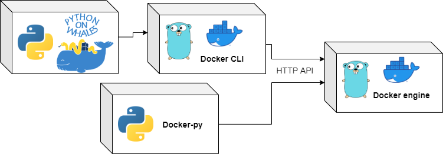

A Docker client for Python, designed to be fun and intuitive!

Works on Linux, macOS and Windows, for Python 3.7 and above. 

The docs can be found at this address: <https://gabrieldemarmiesse.github.io/python-on-whales/>

The GitHub repo can be found at this address: <https://github.com/gabrieldemarmiesse/python-on-whales>


## How to install?

```bash
pip install python-on-whales
```

## Some cool examples

Start by doing
```python
from python_on_whales import docker
```
and then:

* `docker run hello-world` -> [`docker.run("hello-world")`](https://gabrieldemarmiesse.github.io/python-on-whales/sub-commands/container/#run)
* `docker pull ubuntu` -> [`docker.pull("ubuntu")`](https://gabrieldemarmiesse.github.io/python-on-whales/sub-commands/image/#pull)
* `docker build ./` -> [`docker.build("./")`](https://gabrieldemarmiesse.github.io/python-on-whales/sub-commands/buildx/#build)
* `docker compose up my_service` -> [`docker.compose.up(["my_service"])`](https://gabrieldemarmiesse.github.io/python-on-whales/sub-commands/compose/#up)
* `docker image ls` -> [`docker.image.list()`](https://gabrieldemarmiesse.github.io/python-on-whales/sub-commands/image/#list)
* `docker ps` -> [`docker.ps()`](https://gabrieldemarmiesse.github.io/python-on-whales/sub-commands/container/#list)
* `docker cp` -> [`docker.copy()`](https://gabrieldemarmiesse.github.io/python-on-whales/sub-commands/container/#copy)

You get the idea 🙂 it's the same as the CLI we all know and love.

```python
>>> from python_on_whales import docker

>>> output = docker.run("hello-world")
>>> print(output)

Hello from Docker!
This message shows that your installation appears to be working correctly.

...
```


```python
>>> from python_on_whales import docker
>>> print(docker.run("nvidia/cuda:11.0-base", ["nvidia-smi"], gpus="all"))
+-----------------------------------------------------------------------------+
| NVIDIA-SMI 450.51.06    Driver Version: 450.51.06    CUDA Version: 11.0     |
|-------------------------------+----------------------+----------------------+
| GPU  Name        Persistence-M| Bus-Id        Disp.A | Volatile Uncorr. ECC |
| Fan  Temp  Perf  Pwr:Usage/Cap|         Memory-Usage | GPU-Util  Compute M. |
|                               |                      |               MIG M. |
|===============================+======================+======================|
|   0  Tesla T4            On   | 00000000:00:1E.0 Off |                    0 |
| N/A   34C    P8     9W /  70W |      0MiB / 15109MiB |      0%      Default |
|                               |                      |                  N/A |
+-------------------------------+----------------------+----------------------+

+-----------------------------------------------------------------------------+
| Processes:                                                                  |
|  GPU   GI   CI        PID   Type   Process name                  GPU Memory |
|        ID   ID                                                   Usage      |
|=============================================================================|
|  No running processes found                                                 |
+-----------------------------------------------------------------------------+
```

```python
>>> from python_on_whales import docker
>>> my_docker_image = docker.pull("ubuntu:20.04")
20.04: Pulling from library/ubuntu
e6ca3592b144: Downloading [=============>                                     ]  7.965MB/28.56MB
534a5505201d: Download complete
990916bd23bb: Download complete

>>> print(my_docker_image.repo_tags)
['ubuntu:20.04']

>>> docker.image.list()
[python_on_whales.Image(id='sha256:1a437e363abfa', tags=['ubuntu:20.04'])]

>>> my_docker_image.remove()
```

```python
>>> from python_on_whales import docker
>>> my_image = docker.build(".", tags="some_name")  # uses Buildx/buildkit by default
[+] Building 1.6s (17/17) FINISHED
 => [internal] load build definition from Dockerfile                                                            0.0s
 => => transferring dockerfile: 32B                                                                             0.0s
 => [internal] load .dockerignore                                                                               0.0s
 => => transferring context: 2B                                                                                 0.0s
 => [internal] load metadata for docker.io/library/python:3.6                                                   1.4s
 => [python_dependencies 1/5] FROM docker.io/library/python:3.6@sha256:29328c59adb9ee6acc7bea8eb86d0cb14033c85  0.0s
 => [internal] load build context                                                                               0.1s
 => => transferring context: 72.86kB                                                                            0.0s
 => CACHED [python_dependencies 2/5] RUN pip install typeguard pydantic requests tqdm                           0.0s
 => CACHED [python_dependencies 3/5] COPY tests/test-requirements.txt /tmp/                                     0.0s
 => CACHED [python_dependencies 4/5] COPY requirements.txt /tmp/                                                0.0s
 => CACHED [python_dependencies 5/5] RUN pip install -r /tmp/test-requirements.txt -r /tmp/requirements.txt     0.0s
 => CACHED [tests_ubuntu_install_without_buildx 1/7] RUN apt-get update &&     apt-get install -y       apt-tr  0.0s
 => CACHED [tests_ubuntu_install_without_buildx 2/7] RUN curl -fsSL https://download.docker.com/linux/ubuntu/g  0.0s
 => CACHED [tests_ubuntu_install_without_buildx 3/7] RUN add-apt-repository    "deb [arch=amd64] https://downl  0.0s
 => CACHED [tests_ubuntu_install_without_buildx 4/7] RUN  apt-get update &&      apt-get install -y docker-ce-  0.0s
 => CACHED [tests_ubuntu_install_without_buildx 5/7] WORKDIR /python-on-whales                                  0.0s
 => CACHED [tests_ubuntu_install_without_buildx 6/7] COPY . .                                                   0.0s
 => CACHED [tests_ubuntu_install_without_buildx 7/7] RUN pip install -e .                                       0.0s
 => exporting to image                                                                                          0.1s
 => => exporting layers                                                                                         0.0s
 => => writing image sha256:e1c2382d515b097ebdac4ed189012ca3b34ab6be65ba0c650421ebcac8b70a4d                    0.0s
 => => naming to docker.io/library/some_image_name
```

## Some more `docker.run()` advanced examples with postgres

```bash
docker run --name some-postgres -e POSTGRES_PASSWORD=mysecretpassword -d postgres
```
becomes
```python
from python_on_whales import docker

docker.run(
    "postgres:9.6",
    name="some-postgres",
    envs={"POSTGRES_PASSWORD": "mysecretpassword"},
    detach=True,
)
print(docker.ps())
# [python_on_whales.Container(id='f5fb939c409d', name='some-postgres')]
```

-----

```bash
docker run -it --rm --network some-network postgres psql -h some-postgres -U postgres
```
becomes
```python
from python_on_whales import docker

# since it's interactive, you'll be dropped into the psql shell. The python code
# will continue only after you exit the shell.
docker.run(
    "postgres:9.6",
    ["psql", "-h", "some-postgres", "-U", "postgres"],
    networks=["some-network"],
    interactive=True,
    tty=True,
    remove=True,
)
```
----------


```bash
docker run -d --name some-postgres -e POSTGRES_PASSWORD=mysecretpassword -e PGDATA=/var/lib/postgresql/data/pgdata -v /custom/mount:/var/lib/postgresql/data -v myvolume:/tmp/myvolume postgres -c shared_buffers=256MB -c max_connections=200
```
becomes
```python
from python_on_whales import docker

docker.run(
    "postgres:9.6",
    ["-c", "shared_buffers=256MB", "-c", "max_connections=200"],
    name="some-postgres",
    envs={"POSTGRES_PASSWORD": "mysecretpassword", "PGDATA": "/var/lib/postgresql/data/pgdata"},
    volumes=[("/custom/mount", "/var/lib/postgresql/data"), ("myvolume", "/tmp/myvolume")],
    detach=True,
)
```


## Main features

* 1 to 1 mapping between the CLI interface and the Python API. No need to look in the docs
what is the name of the function/argument you need.
* Support for the latest Docker features: 
[Docker buildx/buildkit](https://github.com/docker/buildx), 
`docker run --gpu=all ...`
* Support for Docker stack, services and Swarm (same API as the command line).
* Progress bars and progressive outputs when pulling, pushing, loading, building...
* Support for some other CLI commands that are not in [Docker-py](https://docker-py.readthedocs.io/en/stable/): 
`docker cp`, `docker run --cpus ...` and more.
* Nice SSH support for remote daemons.
* Docker object as Python objects: Container, Images, Volumes, Services... and their
attributes are updated in real-time!
* Each Docker object can be used as a context manager. When getting out of the 
context, the Docker object is removed automatically, even if an exception occurs.
* A fully typed API (Mypy and IDE-friendly) compatible with `pathlib` and `os.path`
* All Docker objects and the Docker client are safe to use with multithreading and multiprocessing.
* Display the commands called and the environment variables used by setting the environment variable `PYTHON_ON_WHALES_DEBUG=1`.

## Why another project? Why not build on Docker-py?

In a sense this project is built on top of [Docker-py](https://docker-py.readthedocs.io/en/stable/) 
because the implementation, the organisation and the API is inspired from the project, but the codebases 
could not be the same.

Two major differences do not permit that:

1) The API is quite different. The aim of Python on Whales is to provide a 1-to-1 
mapping between the Docker command line and Python, so that users don't even have 
to open the docs to do write code.

2) While [Docker-py](https://docker-py.readthedocs.io/en/stable/) is a complete re-implementation of the Docker client binary 
(written in Go), Python on whales sits on top of the Docker client binary, which makes 
implementing new features much easier and safer. For example, it's 
[unlikely that docker-py supports Buildx/buildkit](https://github.com/docker/docker-py/issues/2230#issuecomment-454344497)
anytime soon because rewriting a large Go codebase in Python is hard work.





## Should I use Docker-py or Python on Whales?

Well, it's written in each project's description!

* Docker-py: A Python library for the Docker Engine API
* Python on whales: An awesome Python wrapper for an awesome Docker CLI


If you need to talk to the Docker engine directly, you need to do low level operations,
use docker-py. Some good example would be writing the code to control docker from an IDE, 
or if the speed of Docker calls is very important. 
If you don't want to depend on the Docker CLI binary (~50MB), use docker-py.


If you wanted to call the docker command line from Python, 
do high level operations, use Python on Whales.
For example if you want to write your CI logic in Python rather than in bash (a very good choice 😉).
Some commands are only available in Python on whales 
too: `docker.buildx.build(...)`, `docker.stack.deploy(...)`...

Use the right tool for the right job 🙂

## Where is the project now? Where is it going?

| sub-command  | Functions implemented  | Progress |
|---|---|---|
| buildx  | 10/11 |  |
| compose  | 18/23 |  |
| config  | 4/4 |  |
| container | 22/24 |  |
| context  | 4/6 |  |
| image  | 12/13 |  |
| manifest  | 0/4 |  |
| network  | 7/7 |  |
| node  | 7/7 |  |
| plugins  | 10/10 |  |
| secret  | 4/4 |  |
| service  | 7/9 |  |
| stack  | 5/5 |  |
| swarm  | 8/8 |  |
| system  | 3/4 |  |
| trust  | 0/3 |  |
| volume  | 7/7 |  |

Take those numbers with a grain of salt. The functions don't all need the same amount of work to be implemented.

## Alternatives to Docker: Podman, nerdctl...

Support for Docker-compatible clients like [Podman](https://podman.io/) and [Nerdctl](https://github.com/containerd/nerdctl) was introduced in Python-on-whales version 0.44.0.

You can use an arbitrary binary to execute Docker commands by using the argument `client_call` of `python_on_whales.DockerCLient`.
Here is an example:
```python
>>> from python_on_whales import DockerClient

>>> nerdctl = DockerClient(client_call=["nerdctl"])

>>> nerdctl.pull("python:3.9")
docker.io/library/python:3.9:                                                     resolved       |++++++++++++++++++++++++++++++++++++++|
index-sha256:a83c0aa6471527636d7331c30704d0f88e0ab3331bbc460d4ae2e53bbae64dca:    done           |++++++++++++++++++++++++++++++++++++++|
manifest-sha256:8ccef93ff3c9e1bb9562d394526cdc6834033a0498073d41baa8b309f4fac20e: done           |++++++++++++++++++++++++++++++++++++++|
config-sha256:f033692e2c5abe1e0ee34bcca759a3e4432b10b0031174b08d48bcc90d14d68b:   done           |++++++++++++++++++++++++++++++++++++++|
layer-sha256:9952b1051adaff513c99f86765361450af108b12b0073d0ba40255c4e419b481:    done           |++++++++++++++++++++++++++++++++++++++|
layer-sha256:c766e27afb21eddf9ab3e4349700ebe697c32a4c6ada6af4f08282277a291a28:    done           |++++++++++++++++++++++++++++++++++++++|
layer-sha256:1535e3c1181a81ea66d5bacb16564e4da2ba96304506598be39afe9c82b21c5c:    done           |++++++++++++++++++++++++++++++++++++++|
layer-sha256:6de7cb7bdc8f9b4c4d6539233fe87304aa1a6427c3238183265c9f02d831eddb:    done           |++++++++++++++++++++++++++++++++++++++|
layer-sha256:967757d5652770cfa81b6cc7577d65e06d336173da116d1fb5b2d349d5d44127:    done           |++++++++++++++++++++++++++++++++++++++|
layer-sha256:c357e2c68cb3bf1e98dcb3eb6ceb16837253db71535921d6993c594588bffe04:    done           |++++++++++++++++++++++++++++++++++++++|
layer-sha256:26787c68cf0c92a778db814d327e283fe1da4434a7fea1f0232dae8002e38f33:    done           |++++++++++++++++++++++++++++++++++++++|
layer-sha256:6aefca2dc61dcbcd268b8a9861e552f9cdb69e57242faec64ac120d2355a9c1a:    done           |++++++++++++++++++++++++++++++++++++++|
layer-sha256:32a180f5cf85702e7680719c40c39c07972b1176355df5a621de9eb87ad07ce2:    done           |++++++++++++++++++++++++++++++++++++++|
elapsed: 35.9s                                                                    total:  333.5  (9.3 MiB/s)

python_on_whales.Image(id='sha256:f033692e2c5ab', tags=['python:3.9'])
```

You can do something similar with podman:

```python
from python_on_whales import DockerClient

podman = DockerClient(client_call=["podman"])

podman.pull("hello-world")
podman.run("hello-world")
print(podman.ps())
...
```


## Contributing

Any and all PRs are welcome. Please see [this documentation](./CONTRIBUTING.md).

## What about the license?

It's a MIT license, so quite permissive.

The license can be found [in the git repository](https://github.com/gabrieldemarmiesse/python-on-whales/blob/master/LICENSE).
